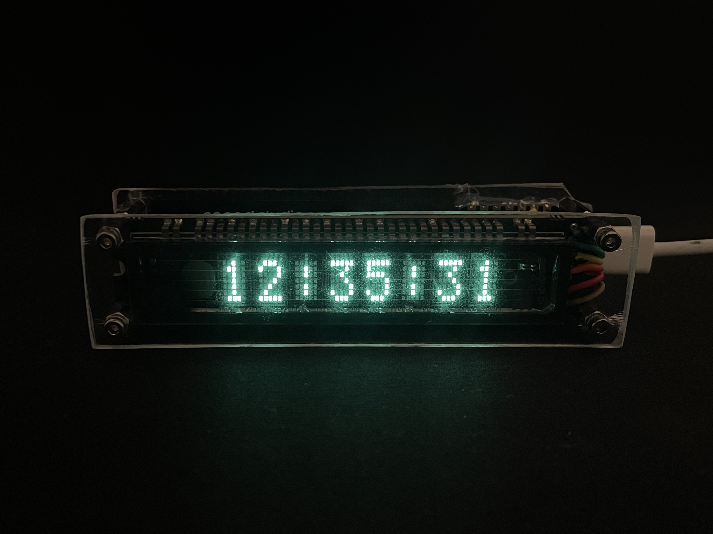
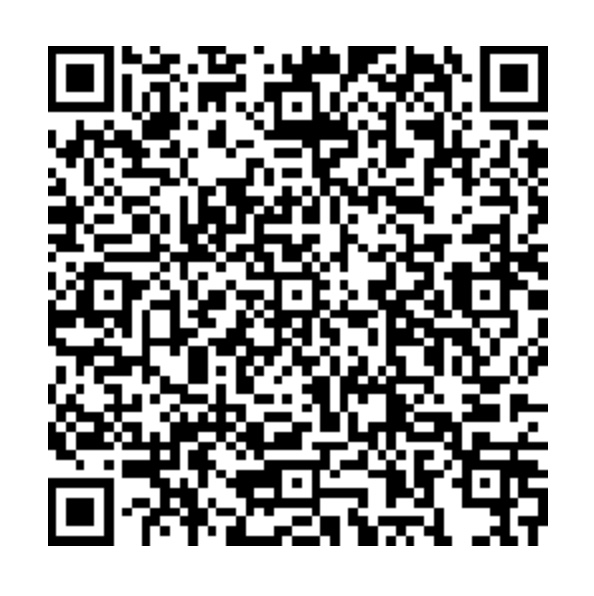
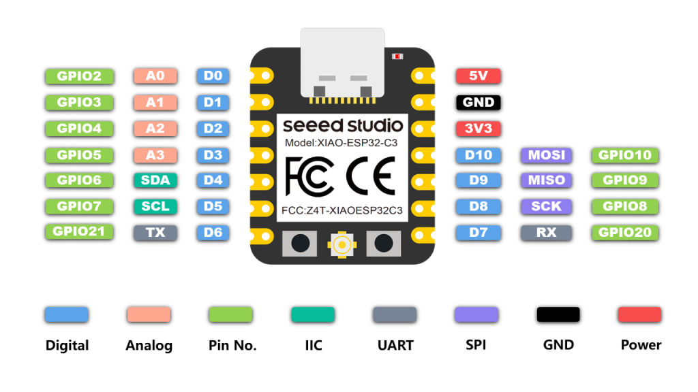

# Wi-Fi clock

> *A **simple clock** powered by an **ESP32**, featuring an old-school **VFD display** for a retro aesthetic. This project syncs time via the **internet**, ensuring accurate and reliable timekeeping without manual adjustments.*

### Wifi provisioning
Wi-Fi provisioning allows configuring and connecting the device to a Wi-Fi network without hardcoding credentials. This is especially useful for IoT applications, allowing users to set up Wi-Fi easily via a smartphone or another device. 
It works using Bluetooth where the ESP32 creates a temporary access point or uses BLE to receive Wi-Fi credentials securely.

Espressif provides an official [ESP BLE Provisioning](https://apps.apple.com/us/app/esp-ble-provisioning/id1473590141) app for iOS (and Android), enabling seamless Wi-Fi setup using Bluetooth. 
This makes deployments more user-friendly, eliminating the need to reflash firmware for network changes.

Scan the QR code for setting up WiFi network.

### Time sync
The clock gets its time from the internet using NTP (Network Time Protocol), so you never have to set it manually! NTP works by asking a time server for the current UTC time and then adjusting the clock accordingly. 
Since the ESP32 doesn’t have a built-in battery-backed clock, this ensures it always shows the right time, even after a restart or power loss.

You can configure your timezone in [datetime.c](./main/datetime.c).
After that, just connect it to Wi-Fi, and it handles the rest! ⏰🌍

### VFD display
A VFD (Vacuum Fluorescent Display) is a retro display tech that gives off a bright, high-contrast glow—just like the ones you’d find in vintage clocks, old-school radios, and cash registers. Unlike LCDs, it lights up on its own, so it's super easy to read in any lighting.

This project uses an **SPI** connection to talk to the VFD driver, meaning the ESP32 sends data over just a few wires to control what gets displayed.

Check [Aliexpress](https://www.aliexpress.com/item/1005002932421503.html) or VFD display [datasheet](./assets//futaba-datasheet.pdf) to learn more about the specifics.

### ESP32
This project specifically uses the [XIAO_ESP32C3](https://wiki.seeedstudio.com/XIAO_ESP32C3_Getting_Started/), a compact ESP32-C3 board that’s great for small builds but has some differences from other ESP32 models. 
One key thing to note is that it uses **different GPIO port numbers** in ESP-IDF, so make sure to check the correct pin mappings before wiring things up! 
You can check the [arduino-esp32](https://github.com/espressif/arduino-esp32/blob/master/variants/XIAO_ESP32C3/pins_arduino.h) project for the details or view [vfd.h](./main/vfd.h)

